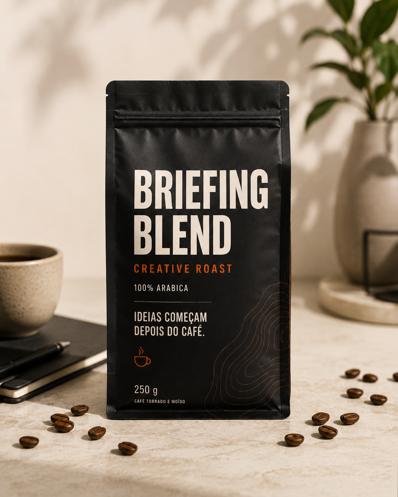
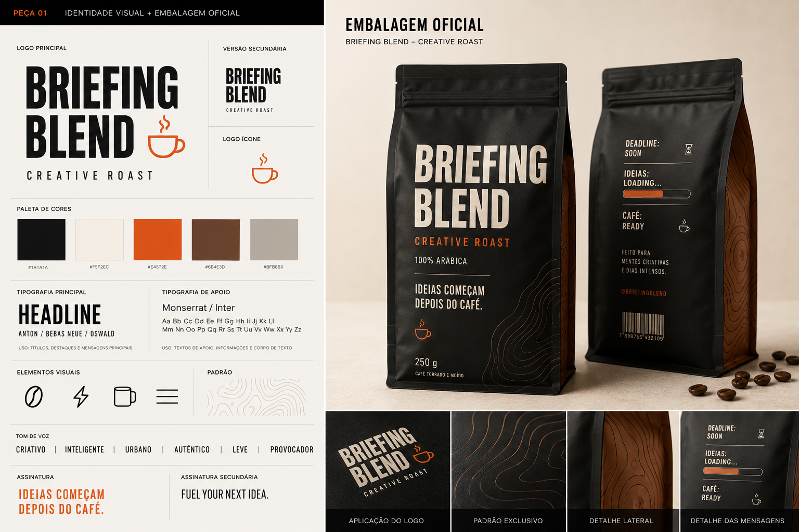
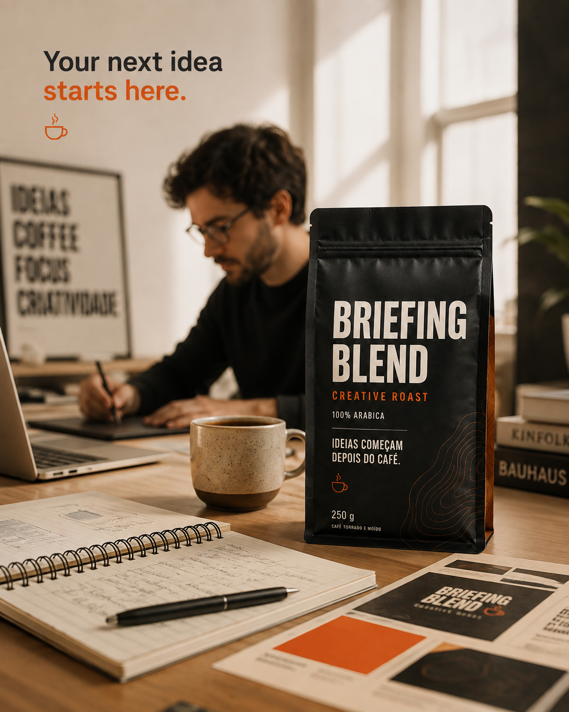

# ☕ Briefing Blend

### Uma marca que não existe. Um produto que nunca foi fabricado. Uma campanha criada com Inteligência Artificial Generativa.

<p align="center">
  
</p>

<p align="center">
  <strong>Ideias começam depois do café.</strong><br>
  <em>Fuel your next idea.</em>
</p>

---

## 📒 Descrição

O **Briefing Blend** é um projeto experimental de branding, publicidade e produção audiovisual desenvolvido para o desafio **Natural ou Fake Natty? Como Vencer na Era das IAs Generativas**, da DIO.

O objetivo foi explorar até que ponto diferentes ferramentas de Inteligência Artificial Generativa poderiam participar da criação de uma campanha publicitária completa e produzir materiais suficientemente realistas para pertencerem a uma marca verdadeira.

Para realizar o experimento, foi criada do zero uma marca fictícia de café direcionada a profissionais criativos.

O projeto passou por diferentes etapas:

- conceito e posicionamento;
- identidade visual;
- embalagem;
- fotografia publicitária;
- lifestyle;
- planejamento de peças para redes sociais;
- roteiro;
- geração audiovisual;
- comercial final.

A pergunta que orientou todo o processo foi:

> **Se você não soubesse que essa marca não existe, acreditaria que esta campanha é real?**

---

# ☕ A Marca

## Briefing Blend

**Categoria:** Café especial<br>
**Produto:** Creative Roast<br>
**Público:** profissionais de marketing, publicidade, design, conteúdo, tecnologia e outras áreas criativas.

### Posicionamento

O Briefing Blend foi concebido como um café associado ao ritual que antecede o processo criativo.

A ideia não é apresentar o café como uma solução mágica para a criatividade, mas como parte daquele pequeno momento de preparação antes de começar um novo trabalho.

### Conceito

```text
Briefing aberto.
Tela em branco.
Deadline chegando.
Ideias carregando.

Café servido.

A ideia começa.
```

### Slogan

> **Ideias começam depois do café.**

### Assinatura

> **Fuel your next idea.**

---

# 🎯 Objetivo do Experimento

O objetivo do projeto foi criar um pequeno ecossistema de marca utilizando Inteligência Artificial Generativa.

Em vez de produzir apenas uma imagem ou um vídeo isolado, o desafio foi construir diferentes pontos de contato que parecessem fazer parte da mesma campanha.

O experimento envolveu:

**Estratégia → Branding → Packaging → Fotografia → Vídeo**, com desdobramentos de Social Media planejados.

O desafio principal passou a ser não apenas gerar peças visualmente interessantes, mas manter **consistência entre marca, produto, linguagem, iluminação, direção de arte e narrativa**.

---

# 🎨 Identidade Visual

A identidade do Briefing Blend foi desenvolvida buscando uma estética:

- minimalista;
- contemporânea;
- urbana;
- editorial;
- criativa;
- premium.

A direção visual utiliza principalmente:

| Elemento | Referência |
|---|---|
| Preto carvão | `#1A1A1A` |
| Creme | `#F5F2EC` |
| Laranja queimado | `#E4572E` |
| Marrom café | `#6B4E3D` |

A embalagem utiliza preto como elemento predominante e detalhes em laranja para criar contraste e reforçar a personalidade criativa da marca.

## Brand Board

<p align="center">
  
</p>

---

# 📦 Packaging

O produto principal desenvolvido para o projeto foi o:

## Briefing Blend - Creative Roast

Um café especial fictício apresentado em embalagem premium de 250 g.

A identidade combina estética de café especial com pequenas referências ao universo de publicidade e criatividade.

A embalagem oficial está apresentada no [Brand Board](assets/brand/brand-board.png), com frente, verso e detalhes, e no [Hero Shot](assets/product/hero-shot.png). Não foi localizado um arquivo autônomo de packaging; as imagens existentes documentam essa entrega.

A própria embalagem também incorpora a mensagem principal da campanha:

> **Ideias começam depois do café.**

---

# 📸 Fotografia Publicitária

Depois da definição da marca e da embalagem, foram desenvolvidas imagens publicitárias sintéticas.

Nenhuma fotografia de produto foi realizada em estúdio físico.

## Hero Shot

O Hero Shot foi criado para simular uma fotografia profissional de produto.

<p align="center">
  
</p>

A direção de arte buscou reproduzir características comuns de fotografia comercial:

- iluminação lateral;
- sombras naturais;
- profundidade de campo;
- composição minimalista;
- valorização da textura da embalagem;
- presença discreta de elementos relacionados ao café.

---

# 💻 Lifestyle

A segunda abordagem fotográfica coloca o produto dentro de seu contexto de consumo.

O cenário representa o ambiente de trabalho de um profissional criativo, reforçando o posicionamento da marca.

<p align="center">
  
</p>

A intenção foi conectar visualmente três elementos:

**trabalho + criatividade + café.**

---

# 📱 Social Media

O planejamento definiu desdobramentos para Instagram Feed e Story, usando o slogan **“Ideias começam depois do café.”** e referências ao cotidiano criativo: briefing, deadline e bloqueio criativo.

Os arquivos finais dessas duas peças não foram localizados no histórico acessível nem no pacote de produção. Por isso, não são apresentados como entregas concluídas ou como imagens no README. O briefing e a pendência estão documentados em [Social Media](prompts/05-social-media.md). A pasta `assets/social/` está reservada para esses arquivos.

---

# 🎬 Comercial Briefing Blend

O projeto também evoluiu para a criação de um comercial vertical para a marca.

### Formato

**9:16**

### Duração

**15 segundos — 1080 × 1920, 30 fps, MP4 H.264 com áudio AAC.**

A exportação amplia os takes Pika de 470 × 784; a resolução de entrega não corresponde à resolução nativa das gerações.

### Conceito

**O café como ritual que antecede uma boa ideia.**

### Estrutura narrativa

O filme foi desenvolvido em cinco momentos.

#### 01. Bloqueio criativo

Um profissional aparece diante do notebook enfrentando um momento de bloqueio criativo.

#### 02. O ritual do café

O preparo do café funciona como ponto de transição da narrativa.

#### 03. A ideia começa a fluir

O personagem retorna ao trabalho com mais foco e concentração.

#### 04. Hero Shot

O Briefing Blend passa a ocupar o centro da narrativa visual.

#### 05. Packshot

O filme termina com uma cartela de assinatura montada localmente no Codex, com produto isolado sobre fundo carvão. A versão de vídeo inicialmente gerada para esse encerramento foi substituída.

### 🎥 Vídeo Final

➡️ **[Assistir ou baixar o comercial Briefing Blend](assets/video/briefing-blend-commercial-final.mp4)**

Arquivo final V01 recuperado da produção, com locução em português, trilha instrumental e efeitos sonoros. No GitHub, abra o arquivo e use a opção de baixar caso a reprodução não esteja disponível.

---

# 🤖 Tecnologias Utilizadas

## ChatGPT

Utilizado durante as etapas estratégica e criativa para:

- definição do conceito;
- posicionamento;
- naming;
- slogan;
- tom de voz;
- copywriting;
- direção criativa;
- planejamento das peças;
- desenvolvimento do roteiro;
- criação e refinamento dos prompts;
- documentação do projeto.

---

## ChatGPT Images

Utilizado para desenvolver os principais elementos visuais da campanha:

- identidade visual;
- embalagem;
- fotografia de produto;
- Hero Shot;
- Lifestyle;
- imagens de referência para o vídeo e base visual da cartela final.

Na preparação do vídeo, Hero Shot e Lifestyle receberam versões verticais, e uma nova base de imagem foi criada para a cartela de encerramento. Os prompts dessas adaptações foram preservados.

---

## Codex

O **Codex** foi utilizado como ambiente de produção e orquestração da etapa audiovisual.

O fluxo permitiu concentrar a produção do comercial em um ambiente capaz de organizar:

- assets;
- referências visuais;
- prompts;
- estrutura das cenas;
- gerações;
- arquivos do projeto;
- processo de construção do vídeo final.

---

## Pika.art

O **Pika.art** foi utilizado dentro do fluxo executado no Codex como ferramenta de Inteligência Artificial Generativa responsável pela criação das cenas em vídeo.

O Pika 2.5 foi operado pelo site no fluxo conduzido pelo Codex: texto para vídeo nas cenas 1 e 2, e imagem para vídeo nas cenas 3 e 4. Também foi testada uma geração para a cena 5, substituída por uma cartela local na montagem final.

## vidIQ

Utilizado no fluxo do Codex para gerar a locução em português e a trilha instrumental. A sincronização, a composição dos textos, os efeitos sonoros sintéticos e a montagem final foram realizados localmente no Codex.

---

# 🧠 Processo de Criação

O projeto foi construído progressivamente.

## Etapa 01 - Estratégia

O primeiro passo foi definir uma marca fictícia capaz de justificar diferentes formatos de conteúdo.

Foram desenvolvidos:

- público;
- posicionamento;
- personalidade;
- conceito;
- slogan;
- assinatura;
- identidade verbal.

O resultado foi o **Briefing Blend**.

---

## Etapa 02 - Identidade Visual

Depois da estratégia, foi definido o universo visual da marca.

A direção escolhida combinou:

**minimalismo + café premium + cultura criativa.**

Foi criado um Brand Board para funcionar como referência visual para as demais etapas.

---

## Etapa 03 - Embalagem

A identidade foi então aplicada a uma embalagem fictícia.

Esse asset se tornou uma das principais referências visuais do projeto, porque precisava permanecer reconhecível nas diferentes peças.

---

## Etapa 04 - Fotografia Sintética

A embalagem foi inserida em composições que simulam fotografias realizadas em estúdio.

Foram trabalhados elementos como:

- iluminação;
- enquadramento;
- lente;
- profundidade de campo;
- superfícies;
- composição;
- ambientação.

A intenção foi aproximar o resultado da linguagem utilizada em campanhas reais de produtos premium.

---

## Etapa 05 - Lifestyle

O produto foi colocado dentro de um ambiente relacionado ao público-alvo.

O objetivo foi demonstrar como uma imagem inteiramente sintética poderia reproduzir a linguagem de fotografia lifestyle utilizada por marcas reais.

---

## Etapa 06 - Social Media

Foram definidos formatos, mensagens e composição para Feed e Story. A execução das peças finais não pôde ser comprovada pelos arquivos disponíveis; o [registro dessa etapa](prompts/05-social-media.md) distingue o briefing das entregas efetivamente recuperadas.

---

# 🎥 Processo de Criação do Vídeo

O comercial foi produzido no **Codex**, com geração de cenas no **Pika.art**. O processo real está registrado em [06-video.md](prompts/06-video.md), incluindo os prompts enviados, versões testadas e seleção final.

1. **Roteiro e referências:** cinco momentos narrativos, com identidade, Hero Shot e Lifestyle já definidos. As duas fotografias foram adaptadas para referências verticais por expansão do cenário.
2. **Geração:** sete takes de aproximadamente 5 segundos no Pika 2.5 — uma versão das cenas 1 e 2, duas versões das cenas 3 e 4 e uma versão da cena 5.
3. **Revisão e refinamento:** as cenas 3 e 4 receberam instruções de câmera fixa após movimentos superiores ao solicitado. As correções foram parciais; o usuário escolheu as versões V01 de ambas.
4. **Encerramento:** a cena 5 gerada repetia a apresentação do produto. Foi substituída por uma cartela local de 2 segundos, com imagem derivada da embalagem e assinatura sobre fundo carvão.
5. **Montagem e áudio:** seleção dos trechos, textos, transições, locução e trilha geradas no vidIQ, efeitos sintéticos e exportação no ambiente do Codex.

| Cena | Intervalo no filme | Versão utilizada |
|---|---|---|
| Bloqueio criativo | 0–3s | Pika V01 |
| Ritual do café | 3–6s | Pika V01 |
| Retomada do foco | 6–10s | Pika V01, escolhida pelo usuário |
| Hero Shot | 10–13s | Pika V01, escolhida pelo usuário |
| Cartela final | 13–15s | V02 local |

Os registros de produção informam decodificação integral de 450 quadros, 15 segundos, áudio a −16,01 LUFS e pico verdadeiro de −1,48 dBTP. Esses valores são registros da validação anterior; a revisão auditiva não foi registrada nessa execução. A Cena 3 mantém a saída da headline do enquadramento na versão escolhida. Não se presume fidelidade perfeita de todas as letras da embalagem durante a animação.

---

# 🔬 Engenharia de Prompts

Um dos principais aprendizados do projeto foi perceber que uma boa geração raramente depende apenas do primeiro prompt.

O processo utilizado foi iterativo:

```text
IDEIA
  ↓
PROMPT
  ↓
GERAÇÃO
  ↓
ANÁLISE
  ↓
PROBLEMA IDENTIFICADO
  ↓
REFINAMENTO
  ↓
NOVA GERAÇÃO
  ↓
RESULTADO FINAL
```

A evolução dos prompts foi orientada principalmente pela necessidade de controlar:

- composição;
- iluminação;
- comportamento da câmera;
- aparência do produto;
- continuidade;
- movimento;
- realismo.

A documentação distingue solicitações recuperadas da conversa, briefing aprovado, prompts de produção preservados e testes efetivamente realizados. Os prompts internos das primeiras gerações estáticas não aparecem no histórico acessível; não foram reconstruídos como se fossem transcrições.

- [01 — Branding](prompts/01-branding.md)
- [02 — Packaging](prompts/02-packaging.md)
- [03 — Fotografia de produto](prompts/03-product-photography.md)
- [04 — Lifestyle](prompts/04-lifestyle.md)
- [05 — Social Media](prompts/05-social-media.md)
- [06 — Vídeo](prompts/06-video.md)

---

# 🧪 Exemplo de Refinamento

## Cena 3 — Lifestyle em movimento

**Prompt V01:** solicitava deslocamento lateral suave e pequeno avanço final, preservando personagem, produto e headline.

**Problema observado:** a câmera se movimentou além do esperado. A embalagem foi parcialmente cortada e a frase “Your next idea starts here.” saiu do quadro.

**Prompt V02:** passou a pedir câmera totalmente fixa em tripé, sem zoom, avanço ou reenquadramento, com embalagem e headline inteiras até o último quadro.

**Resultado:** o movimento foi reduzido, mas a correção não foi completa. Após comparar as opções, o usuário selecionou a V01 para o filme. O refinamento é documentado como tentativa real, sem afirmar que todos os problemas foram resolvidos.

Os dois prompts integrais e o teste equivalente do Hero Shot estão em [06-video.md](prompts/06-video.md).

---

# 🕵️ Natty or Not?

Essa é a pergunta central do experimento.

As imagens apresentam:

- uma marca que não existe;
- um produto que nunca foi fabricado;
- uma embalagem que nunca foi impressa;
- fotografias realizadas sem câmera;
- cenários sintéticos;
- um comercial criado com IA generativa.

Mesmo assim, todos os elementos foram desenvolvidos buscando reproduzir códigos visuais encontrados em campanhas publicitárias reais.

> **Se você encontrasse o Briefing Blend em um anúncio sem conhecer este projeto, perceberia imediatamente que a marca não existe?**

---

# 🚀 Resultados

O projeto resultou na criação de um pequeno ecossistema de comunicação para uma marca inteiramente fictícia.

| Entregável | Status |
|---|:---:|
| Estratégia da marca | ✅ |
| Naming | ✅ |
| Posicionamento | ✅ |
| Identidade visual | ✅ |
| Brand Board | ✅ |
| Packaging | ✅ Documentado no Brand Board e no Hero Shot |
| Hero Shot | ✅ |
| Fotografia Lifestyle | ✅ |
| Instagram Feed | Planejado; arquivo final não localizado |
| Instagram Story | Planejado; arquivo final não localizado |
| Roteiro publicitário | ✅ |
| Comercial vertical | ✅ |
| Engenharia de prompts | ✅ Registros recuperados e limitações identificadas |
| Documentação | ✅ |

O resultado final não é apenas uma peça gerada por IA, mas uma campanha composta por diferentes formatos que compartilham uma mesma identidade.

---

# 💭 Reflexão

O principal aprendizado deste projeto foi perceber a diferença entre **gerar conteúdo e dirigir conteúdo**.

Ferramentas generativas conseguem transformar uma descrição em imagem ou vídeo em pouco tempo. Entretanto, quando diferentes materiais precisam pertencer ao mesmo universo de marca, novas dificuldades aparecem.

Consistência de produto, continuidade visual, iluminação, enquadramento, tipografia, comportamento dos personagens e movimento de câmera precisam ser constantemente avaliados.

A primeira geração raramente foi considerada automaticamente como resultado final.

Grande parte do processo envolveu:

**gerar → analisar → identificar problemas → ajustar → gerar novamente.**

Outro aprendizado importante foi o papel das referências visuais.

Quando a IA possuía uma imagem previamente aprovada como base, existiam menos decisões importantes para ela reinventar. Isso ajudou a aproximar diferentes peças de uma mesma linguagem.

Ao final do projeto, a pergunta deixou de ser apenas:

> **Isso foi feito por Inteligência Artificial?**

E passou a ser também:

> **Quanto do resultado pertence à ferramenta e quanto pertence às decisões de quem está dirigindo essa ferramenta?**

A IA tornou a execução muito mais acessível, mas estratégia, seleção, direção criativa, avaliação e refinamento continuaram sendo fundamentais para transformar gerações isoladas em uma campanha coerente.

---

# 📁 Estrutura do Repositório

```text
lab-natty-or-not/
├── README.md
├── assets/
│   ├── manifest.json
│   ├── brand/
│   │   └── brand-board.png
│   ├── product/
│   │   ├── hero-shot.png
│   │   └── lifestyle.png
│   ├── social/
│   │   └── .gitkeep
│   └── video/
│       ├── briefing-blend-commercial-final.mp4
│       └── references/
│           ├── hero-shot-vertical-v01.png
│           ├── lifestyle-vertical-v01.png
│           └── packshot-final-v02.png
├── prompts/
│   ├── 01-branding.md
│   ├── 02-packaging.md
│   ├── 03-product-photography.md
│   ├── 04-lifestyle.md
│   ├── 05-social-media.md
│   └── 06-video.md
└── exemplos/
    ├── E-BOOK.md
    ├── PODCAST.md
    └── VIDEO.md
```

O [manifesto dos assets](assets/manifest.json) registra origem, tamanho e SHA-256 de cada arquivo copiado. Os exemplos originais da DIO foram preservados.

---

# 🔄 Pipeline do Projeto

```text
IDEIA
  ↓
CHATGPT
Estratégia + conceito + direção + prompts
  ↓
CHATGPT IMAGES
Branding + produto + fotografia
  ↓
CODEX
Orquestração da produção audiovisual
  ↓
PIKA.ART
Geração dos takes
  ↓
CODEX + vidIQ
Cartela local + voz e trilha + montagem
  ↓
BRIEFING BLEND
Campanha final
```

---

# 🏁 Conclusão

O Briefing Blend começou como uma ideia simples:

**criar uma marca de café que nunca existiu.**

O experimento acabou se transformando em uma campanha multimodal composta por estratégia, branding, fotografia e vídeo, com desdobramentos de social media planejados.

Toda a construção partiu de ferramentas generativas, mas o processo demonstrou que alcançar um resultado coerente exige mais do que simplesmente escrever um prompt.

É necessário definir uma direção, estabelecer regras, avaliar resultados, identificar inconsistências e decidir o que permanece e o que precisa ser criado novamente.

No final, talvez essa seja a parte mais interessante da relação entre criatividade e Inteligência Artificial:

> **A ferramenta gera possibilidades. A direção transforma essas possibilidades em uma ideia.**

---

## 👨‍💻 Projeto

Desenvolvido como parte do desafio:

**Natural ou Fake Natty? Como Vencer na Era das IAs Generativas**

**Digital Innovation One - DIO**

`#LabDIONattyOrNot`
